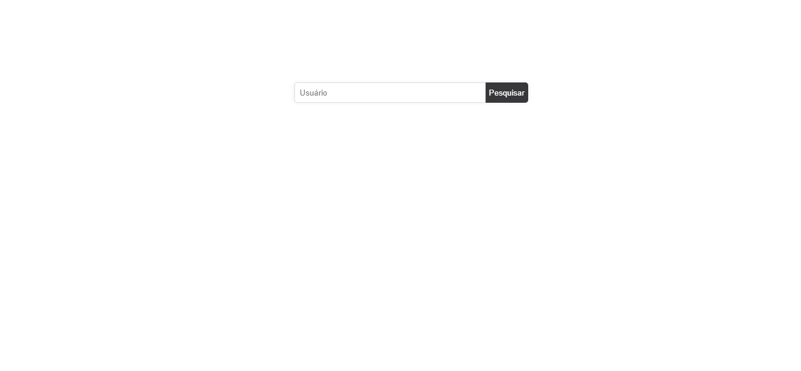

<h1 align="center"> 
  Search Repositories 🔎//🔍
</h1>

  

<h2> Start! </h2>

- Para startar o repositório é preciso abrir o terminal na raiz ( gamagit ) 
- Excutar o comando: yarn start

##

<h2> 🚀 Tecnologias </h2>

- ReactJS
- Axios
- JS
- Styled-components
